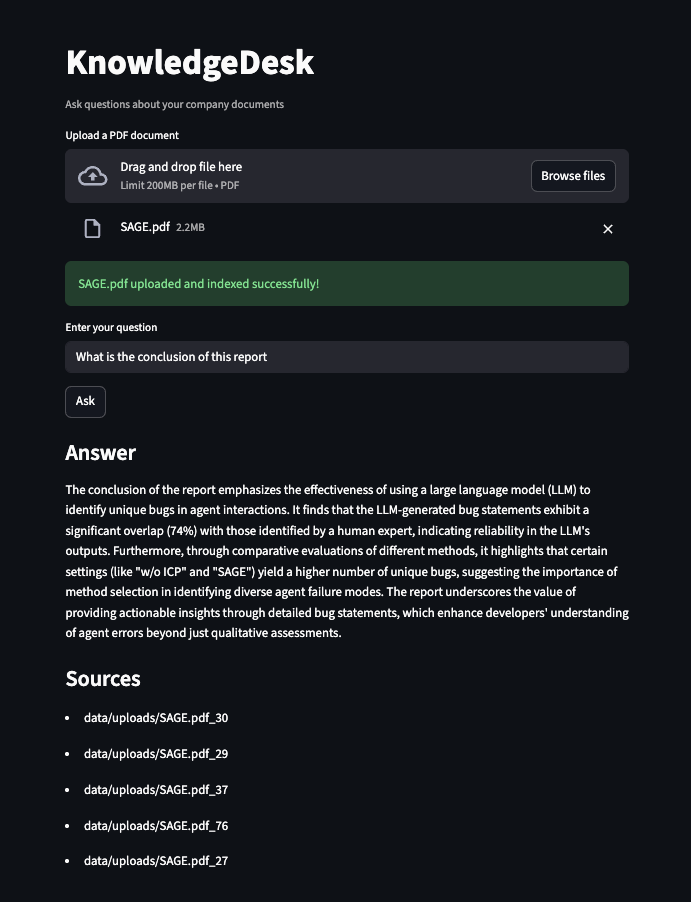

# Enterprise RAG System

Enterprise RAG System is a production-oriented Retrieval-Augmented Generation (RAG) architecture for enterprise knowledge management.

Organizations often store critical knowledge across PDFs, documentation portals, and internal systems. Traditional search tools rely on keyword matching and require employees to know where information lives.

This project explores how to build a reliable, observable, and production-ready RAG system that allows employees to query internal knowledge using natural language while ensuring answers remain grounded in source documents.

The goal is not just a demo pipeline, but a system architecture that addresses real-world challenges in deploying AI systems:
- Retrieval quality
- Evaluation
- Safety and guardrails
- Multi-tenant data isolation
- Observability and monitoring
- Production deployment

This repository documents a 10-week engineering build, evolving from a basic RAG prototype into a production-oriented AI system.

## 1. Current Implementation (Week 1)

The current prototype implements a basic RAG pipeline capable of:
- ingesting PDF documents
- storing embeddings in a vector database
- retrieving relevant context
- generating answers with citations

Current capabilities:
- PDF ingestion
- Vector similarity retrieval
- LLM answer generation
- Source citation support
- REST API
- CLI interface
- Web chat interface

Future iterations will introduce evaluation pipelines, safety mechanisms, multi-tenant architecture, and production deployment infrastructure.

## 2. System Workflow

The system follows a two-stage architecture: document ingestion and query-time retrieval.

### Ingestion pipeline
1. Documents are uploaded to the system
2. Text is extracted from PDFs
3. Documents are split into overlapping chunks
4. Each chunk is converted into embeddings
5. Embeddings are stored in a vector database

### Query pipeline
1. User submits a natural language question
2. The question is converted into an embedding
3. The retriever performs vector similarity search
4. Top-K relevant chunks are retrieved
5. Retrieved context is assembled into a prompt
6. The LLM generates an answer grounded in the retrieved documents
7. The system returns the answer with citations


## 3. Architecture (Week 1 Prototype)


## 4. Tech Stack (Current Prototype)

Current development stack:
- Python
- FastAPI - API layer
- ChromaDB -local vector database
- OpenAI/Anthropic APIs - LLM providers
- Streamlit - web interface
- CLI interface - local querying

Note: The current stack prioritizes simplicity and local development speed. Future iterations may introduce scalable vector stores and production infrastructure.

## 5. Setup

### Prerequisites
- Python 3.9+
- OpenAI API key or Anthropic API key

### Tested on
- Python 3.9

### 5.1 Create and activate virtual environment
```bash
python3 -m venv venv
source venv/bin/activate  # Mac/Linux
```

### 5.2 Install dependencies
```bash
pip install -r requirements.txt
```

### 5.3 Configure environment
```bash
cp .env.example .env
```
Open `.env` and fill in your settings:
- `OPENAI_API_KEY` or `ANTHROPIC_API_KEY`
- `LLM_PROVIDER`: set to `openai` or `anthropic`
- Adjust `CHUNK_SIZE`, `CHUNK_OVERLAP`, `TOP_K_RESULTS` as needed

## 6. Using the System

### Option A: CLI
Run queries directly without starting the API server.

Before querying, ensure that at least one document has been uploaded to:
```bash
data/uploads/
```
Then run: 

```bash
python3 cli.py "YOUR QUESTION"
```

### Option B: Web Interface
Start the API server:
```bash
python3 -m uvicorn app.main:app --reload
```
In a second terminal:
```bash
streamlit run streamlit_app.py
```
Upload at least one PDF before asking questions. Type your question and click **Ask**.


### Example Query

#### Question:
```bash
What is the company parental leave policy?
```
#### Example output:
```bash
Employees are eligible for up to 16 weeks of paid parental leave.
This policy applies to full-time employees after six months of employment.

Sources:
HR Policy Handbook – Section 4.2
```



## 7. Architecture Decision Records

Key architecture decisions are documented in the ADR directory.

Key decisions so far:

- Chunking strategy (800 chars with 150 overlap)
- Vector store choice (ChromaDB for prototype development)
- Multi-LLM provider abstraction

See `/docs/adr` for full decision records.

## 8. Roadmap

This repository documents a **10-week build of a production-oriented enterprise RAG system**, evolving from a local prototype into a more realistic AI system with evaluation, retrieval optimization, tenant isolation, safety, observability, and deployment infrastructure.

- [x] **Week 1 - Core RAG Pipeline**  
  Implement the basic retrieval-augmented generation workflow:  
  document ingestion → chunking → embeddings → vector search → grounded answers with citations.

- [ ] **Week 2 - Retrieval Evaluation**  
  Build an evaluation dataset and baseline metrics for:  
  retrieval recall, answer grounding, and answer correctness.

- [ ] **Week 3 - Multi-Source Ingestion**  
  Extend ingestion beyond PDFs to support:  
  HTML, Markdown, and other enterprise document sources.  
  Standardize parsing, chunking, and metadata extraction across formats.

- [ ] **Week 4 - Retrieval Improvements**  
  Improve retrieval quality through:  
  hybrid search (vector + keyword), metadata filtering, and query rewriting.

- [ ] **Week 5 - Reranking + Evaluation Pipeline**  
  Introduce a reranking stage and implement automated evaluation workflows, including:  
  LLM-as-judge evaluation and regression testing for retrieval or prompt changes.

- [ ] **Week 6 - Storage Abstraction + Managed Backends**  
  Introduce a storage abstraction layer to support both local and managed backends,  
  enabling migration from local development storage to production-oriented cloud persistence.

- [ ] **Week 7 - Multi-Tenant Architecture**  
  Design enterprise-grade tenant isolation with:  
  tenant-aware namespaces, document-level access control, and scoped retrieval.

- [ ] **Week 8 - AI Safety + Observability**  
  Add safety mechanisms and monitoring, including:  
  prompt injection detection, PII filtering, retrieval traces, latency tracking, and token usage monitoring.

- [ ] **Week 9 - Production Infrastructure**  
  Prepare the system for deployment with:  
  containerization, CI/CD pipelines, environment configuration, and staged rollout support.

- [ ] **Week 10 - System Hardening & Scaling**  
  Improve production readiness with:  
  caching, async request handling, load testing, and cost optimization.

## 9. Evaluation Strategy (Planned)

Production AI systems require continuous evaluation.

Upcoming work will introduce an evaluation pipeline measuring:

- retrieval recall
- answer grounding
- answer correctness

Planned evaluation approaches include:

- RAGAS metrics
- curated evaluation datasets
- LLM-as-judge evaluation

## 10. Contributing

This repository currently serves as an engineering build log.

Suggestions and discussions on RAG system architecture, evaluation, and production deployment are welcome.

## 11. License

MIT License