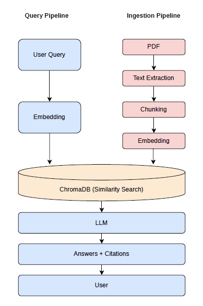

# Enterprise RAG System

**KnowledgeDesk** is a production-grade RAG system for enterprise knowledge management. It allows employees to instantly query HR policies, internal documentation, and company knowledge bases using natural language — returning accurate, cited answers without requiring manual document search or IT support.


## 1. Features

- **PDF Ingestion** — Upload and index company documents automatically
- **Semantic Search** — Retrieve relevant content using vector similarity search (ChromaDB)
- **Q&A with Citations** — Get answers with source references to specific document chunks
- **REST API** — FastAPI backend with `/ingest` and `/ask` endpoints
- **Multi-LLM Support** — Compatible with OpenAI and Anthropic
- **Web UI** — Simple chat interface built with Streamlit
- **CLI** — Lightweight terminal interface for quick queries

---

## 2. Architecture




## 3. Repository Structure
```
├── app/
│   ├── config.py         # Environment and model configuration
│   ├── ingestor.py       # PDF extraction, chunking, embedding
│   ├── retriever.py      # Vector similarity search
│   ├── llm.py            # LLM answer generation 
│   └── main.py           # FastAPI endpoints (/ingest, /ask)
│
├── data/
│   └── uploads/          # Uploaded PDF documents
│
├── docs/
│   ├── architecture.png  # System architecture diagram
│   └── sampleweb.png  # Sample Web UI
│
├── tests/                # Test files
├── streamlit_app.py      # Web UI
├── cli.py                # CLI interface
├── .env.example          # Environment variable template
└── requirements.txt
```

## 4. Setup

### Prerequisites
- Python 3.9+
- OpenAI API key or Anthropic API key

### Tested on
- Python 3.9

### 4.1 Create and activate virtual environment
```bash
python3 -m venv venv
source venv/bin/activate  # Mac/Linux
```

### 4.2 Install dependencies
```bash
pip install -r requirements.txt
```

### 4.3 Configure environment
```bash
cp .env.example .env
```
Open `.env` and fill in your settings:
- `OPENAI_API_KEY` or `ANTHROPIC_API_KEY`
- `LLM_PROVIDER`: set to `openai` or `anthropic`
- Adjust `CHUNK_SIZE`, `CHUNK_OVERLAP`, `TOP_K_RESULTS` as needed

## 5. Interact with the System

### Option A: CLI
Calls the RAG pipeline directly — **no API server needed**.

> **Note:** Before querying, make sure you have uploaded at least one document in `data/uploads/` and run: 

```bash
python3 cli.py "YOUR QUESTION"
```

### Option A: Web UI
Start the API server, then open a second terminal for the UI:
```bash
# Terminal 1
python3 -m uvicorn app.main:app --reload

# Terminal 2
streamlit run streamlit_app.py
```
Upload at least one PDF before asking questions. 

Type your question and click **Ask**.


## 6. Roadmap

- [x] Week 1: Basic RAG pipeline (PDF ingestion, vector search, Q&A with citations)
- [ ] Week 2: Retrieval quality improvements + evaluation pipeline (RAGAS)
- [ ] Week 3: Multi-format ingestion (HTML, Markdown)
- [ ] Week 4: Prompt & model versioning
- [ ] Week 5: Evaluation pipeline with LLM-as-judge + release gating
- [ ] Week 6: Multi-tenant architecture with data isolation
- [ ] Week 7: AI safety layer (prompt injection, PII filtering, human-in-the-loop)
- [ ] Week 8: Observability & monitoring dashboard
- [ ] Week 9: Production deployment with CI/CD and canary rollout